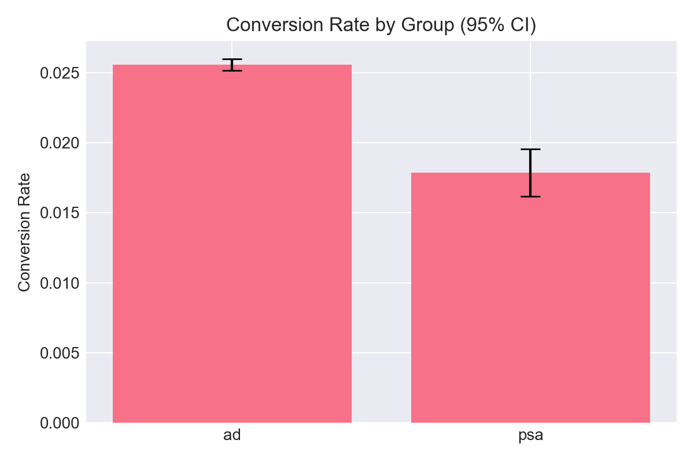
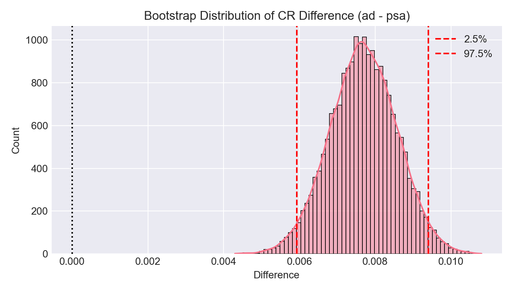
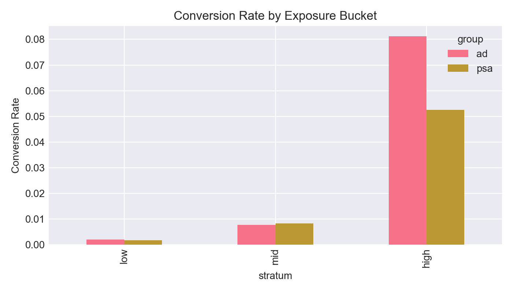
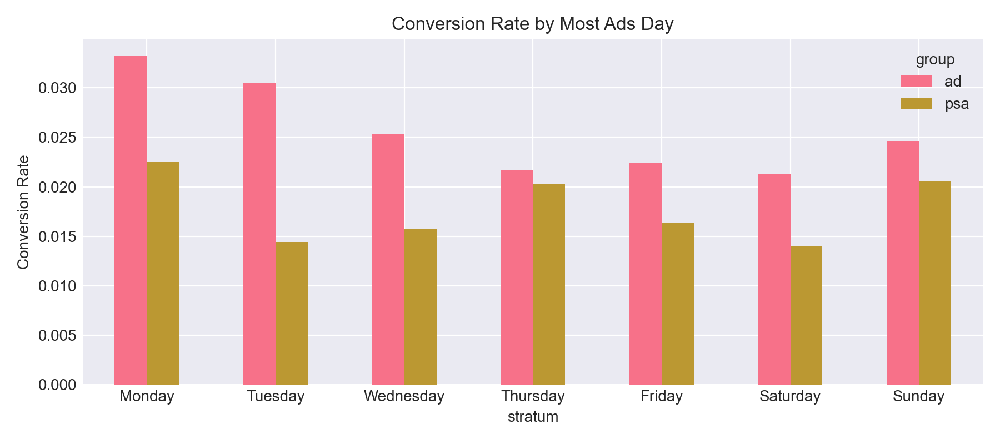
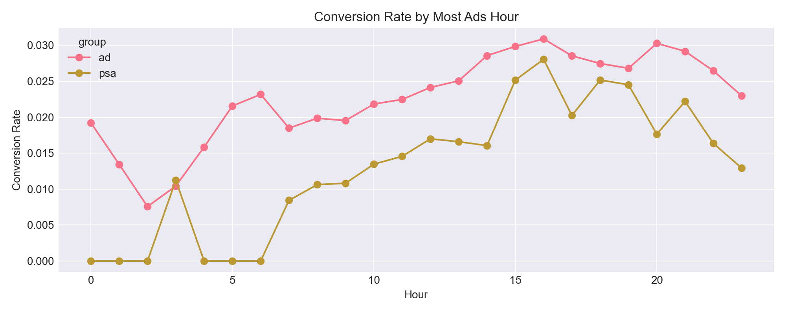

# Marketing A/B Testing Analysis Portfolio


> **项目目标**：基于 Kaggle Marketing A/B Testing 数据集，评估"广告投放（ad）vs 对照组（psa）"对转化率的影响，输出是否值得投放的统计与业务结论。

---

## 核心结论

详见 [实验结论卡](docs/experiment_summary.md)

- **转化率差异**: ad 组 2.555% vs psa 组 1.785%，绝对提升 0.769%（相对提升 43.09%）
- **统计推断**: 两样本比例 Z 检验 p-value=1.71e-13；Bootstrap 95% CI（ad-psa）约为 [0.593%, 0.940%]
- **关键风险**: SRM（样本比例失配）显著，组间比例约 ad=96% / psa=4%，需在真实业务中优先排查随机化/采样机制后再下结论

### 关键图表

| 转化率对比（含 95% CI） | Bootstrap 差异分布 |
|---|---|
|  |  |

| 分层：曝光频次（low/mid/high） | 分层：Most Ads Day |
|---|---|
|  |  |

| 分层：Most Ads Hour |
|---|
|  |

## 🚀 快速开始

**第一次使用？** 请先阅读 [START_HERE.md](START_HERE.md)

```bash
# 1. 下载数据集（从 Kaggle）
# 2. 配置环境
python -m venv venv
./venv/bin/pip install -r requirements.txt

# 3. 运行分析（可复现执行，会生成 docs/figures 下的图表）
./venv/bin/python -m jupyter nbconvert --execute --to notebook --inplace notebooks/01_marketing_ab_test.ipynb

# 4.（可选）交互式打开
./venv/bin/python -m jupyter notebook notebooks/01_marketing_ab_test.ipynb
```

## 项目概述

本项目完整展示了 A/B 测试分析的全流程，包括：
- 实验设计与假设检验
- 数据质量检查与分组对比
- 统计推断（比例检验、置信区间、Bootstrap）
- 业务意义评估（Practical Significance）
- 分层分析与异质性探索

## 技术栈

- **Python**: pandas, numpy, scipy, matplotlib, seaborn
- **统计方法**: 两样本比例检验, Bootstrap CI, 效果量计算
- **可视化**: matplotlib, seaborn

## 数据集

- **来源**: [Kaggle - Marketing A/B Testing](https://www.kaggle.com/datasets/faviovaz/marketing-ab-testing)
- **规模**: 约 588,000 条用户记录
- **字段**:
  - `user id`: 用户唯一标识
  - `test group`: 实验组（ad）或对照组（psa）
  - `converted`: 是否转化（True/False）
  - `total ads`: 用户看到的广告总数
  - `most ads day`: 看到最多广告的星期几
  - `most ads hour`: 看到最多广告的小时

## 项目结构

```
marketing_ab_testing/
├── README.md                          # 项目说明文档
├── requirements.txt                   # Python 依赖包
├── data/                              # 数据目录
│   ├── raw/                          # 原始数据（不提交到 Git）
│   └── processed/                    # 处理后的数据
├── notebooks/                         # Jupyter Notebooks
│   └── 01_marketing_ab_test.ipynb   # 完整分析流程
├── src/                              # 源代码
│   └── ab_utils.py                  # A/B 测试工具函数
├── docs/                             # 文档
│   ├── experiment_summary.md        # 实验结论卡
│   ├── data_dictionary.md           # 数据字典
│   └── figures/                     # 图表输出
└── results/                          # 分析结果
```

## 核心分析模块

### 1. 指标定义
- **主指标**: Conversion Rate（转化率）
- **辅助指标**: 曝光频次、时段分布
- **业务阈值**: MDE（最小可检测效应）设定

### 2. 数据质量检查
- 缺失值与重复值检查
- 分组样本量对比
- 基础分布一致性验证

### 3. 统计推断
- 两样本比例检验（Z-test）
- 95% 置信区间估计
- Bootstrap 置信区间（稳健性验证）

### 4. Practical Significance
- 统计显著性 vs 业务意义
- MDE 阈值判断
- 投放建议与风险评估

### 5. 分层分析
- 按曝光频次分层（低/中/高）
- 按投放时段分层（day/hour）
- 异质性效应探索

## 参考资料

- [Kaggle Dataset](https://www.kaggle.com/datasets/faviovaz/marketing-ab-testing)
- [A/B Testing Best Practices](https://www.exp-platform.com/)

## License

MIT License
